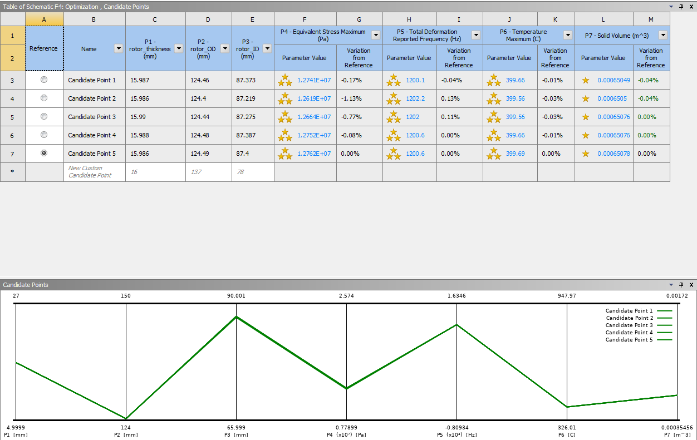

# ANSYS DOE (Design Of Experiment) and Design Optimization

### Problem Description 
---

This project involves the optimization of a vehicle brake design in ANSYS.

The model file of the brake can be downloaded [here (.agdb)][agdb].

The brake design problem has the following objectives:
* Design a brake disc for emergency braking conditions with minimal volume.
* Minimize the maximum stress in the brake disc.
* Maximize the first natural frequency of the brake disc.
* Minimize the maximum temperature in the brake disc.

The three subsystems are as follows:

* **Structural Analysis**: The brake disc has to sustain the pressure from the hydraulically actuated brake pads during sudden braking conditions. Stresses are induced due to friction between the brake pads and the disc. The disc also experiences centrifugal body forces due to its rotation. Resultant stresses generated due these forces can lead to material failure. Therefore, it is of prime importance to make sure that the stresses in the disc are minimized.

* **Modal Analysis**: Free modal analysis is performed to ensure that the disc's first natural frequency is higher than the engine firing frequency. This guarantees that the disc does not experience failure due to resonance.

* **Thermal Analysis**: Braking in a vehicle takes place due to friction between the brake pads and the rotor disc. This leads to heat flux generation in the disc which consequently results in increase in its temperature and thermal stresses. Emergency braking conditions induce high temperatures that damage the contact surfaces. It is therefore essential to minimize the temperature to prevent disc wear and tear.

***

**Procedure:** Initially, structural, modal and thermal analyses are performed in ANSYS. For the assumed geometric constraints, Design Of Experiment (DOE) points are generated. A mathematical model is then generated by performing a 2nd order regression analysis on these DOE points to obtain the volume, stress, frequency and temperature quadratic functions. 

Since this is a multi-objective optimization problem, a multi-objective optimization algorithm such as MOGA can solve it. But MOGA will not always give the best optimum value. Therefore, it is beneficial to convert the multi-objective problem into a single objective problem by assuming the rest of the 
objectives as constraints. In order to use single-objective optimization algorithms for this problem, it is thus necessary to provide upper or lower bounds on the secondary objective functions. The bounds are determined by taking into consideration the brake disc failure.

In this optimization study, we are using the following design variables for the brake disc:
* Inner radius
* Outer radius 
* Thickness 

The optimization problem is designed as follows:

Minimize Volume 
subject to: 
Inner radius ∈[66,90] 
Outer radius ∈[124,150] 
Thickness ∈[5,27] 
Stress <= 14MPa 
First natural frequency >= 1200 Hz 
Temperature <= 400 oC 

All of the variables are continuous.

The boundary conditions imposed on the brake geometry are as follows:
* The inner circumference of the wheel hub has a revolute joint applied.
* The brake caliper pads are constrained in X and Z directions. They are kept free to move
in the Y direction.
* The rotational velocity of 250 rad/s is applied on the disc at the wheel hub attachment point.
* Frictional contact is provided between the brake caliper pads and brake rotor.
* Actuating pressure of 10.496 MPa is applied on the brake pads.

The boundary conditions for the transient thermal analysis are:
* Heat flux of 1.5395e6W/m2 is applied on the swept area of both the pads while the
direction of heat flow is towards the disc.
* Convection is applied on all the surfaces with the air film coefficient of 5W/m2K which
is the default value for standard air.
* Initial temperature is kept at 35oC.

The geometry of the brake is shown below:

#### Static Structural Analysis

The static structural analysis on the disk showing the Von-Mises stress is depicted here:

#### Modal Analysis

The modal analysis on the disk showing the total deformations is depicted below:

#### Transient Thermal Analysis

The transient thermal analysis showing the temperatures on the disk is depicted below:

#### DOE (Design Of Experiment)

For the Design Of Experiment, 40 sample points were chosen with the Latin Hypercube Sampling (LHS) method.

#### Response Surface

The DOE results can be used to create a response surface for prediction purposes.

The chosen method was a **Standard Response Surface**. It uses a polynomial surface 
to fit the data and it requires the least amount of computation in both fitting and 
prediction. However, the performance of the prediction largely depends on the choice 
of the polynomial bases. 

The goodness of fit for all the subsystems are shown below.

Goodness of fit for structural analysis:

Goodness of fit for modal analysis:

Goodness of fit for thermal analysis:

Goodness of fit for all the above:

#### Sensitivity Analysis 

The sensitivity analysis is depicted below:

According to the sensitivity analysis all of the design variables affect the maximum stress and temperature but only two of the three variables affect mostly the other objectives. 

#### Optimization Study

The optimization was done with the **Multiobjective Genetic Algorithm (MOGA)**.
The main objective which is the volume minimization was set as the objective function and the secondary 
objectives were set as constraints. 

The optimization results for 5 candidate points are shown below:

The final optimal dimensions as given by the MOGA algorithm are (for the chosen Candidate Point 1):
* Rotor Thickness = 15.987 mm
* Rotor Inner Diameter = 87.373 mm
* Rotor Outer Diameter = 124.46 mm

With this design, the new volume of the disk brake is 0.00065049 mm^3 (initial volume was 0.00099667 mm^3). Therefore, we have a 
reduction in volume of 32.7%!

