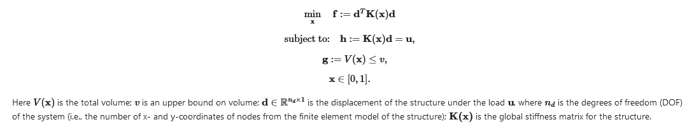
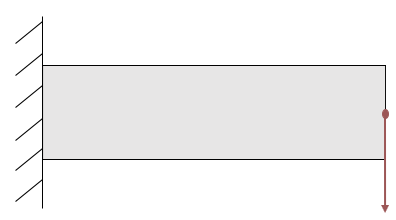
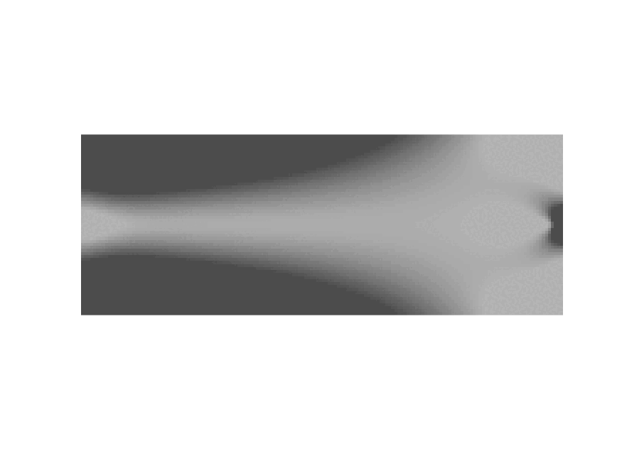
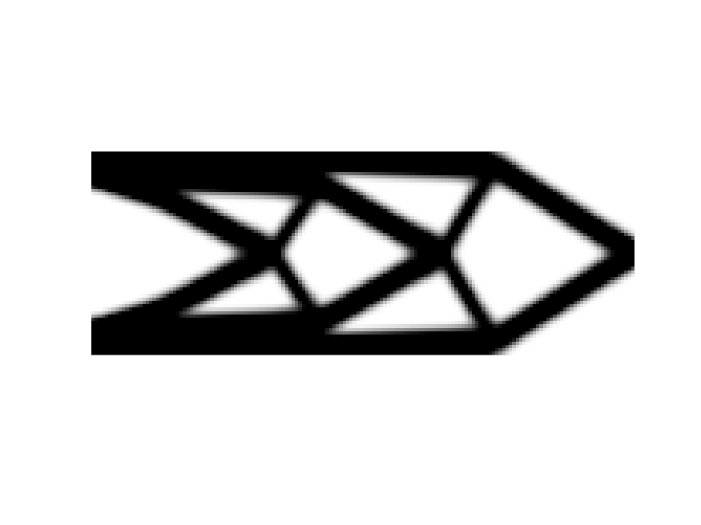

### Application of Reduced Gradient - Topology Optimization

 This project involves the implementation of an optimization algorithm for minimizing the compliance of a structure at its equilibrium state with respect to its topology, based on Dr. Sigmund's topology optimization code.
 
A common topology optimization problem is compliance minimization, where we seek the "stiffest" structure within a certain volume limit to withhold a particular load:

***

The optimization problem that is solved has the following characteristics:
* Boundary conditions: Cantilever beam
* Loading: F=100N at the middle of the right side
* Material properties: Aluminium-alloy with Young's modulus E=71GPa, Poisson's ratio nu=0.33
* Objective: Minimize compliance while achieving at least 50% volume reduction
* nelx=160, nely=60: Number of elements in the x and y directions

The results can be confirmed by running: top88(160,60,0.5,3.0,3.0,1)

The MATLAB code can be found [here](top88.m).

The results during the optimization procedure can be seen in the following animated figure:

The resulting system has a 50% reduction in volume with a compliance of 18832. The final design of the beam is shown below:

